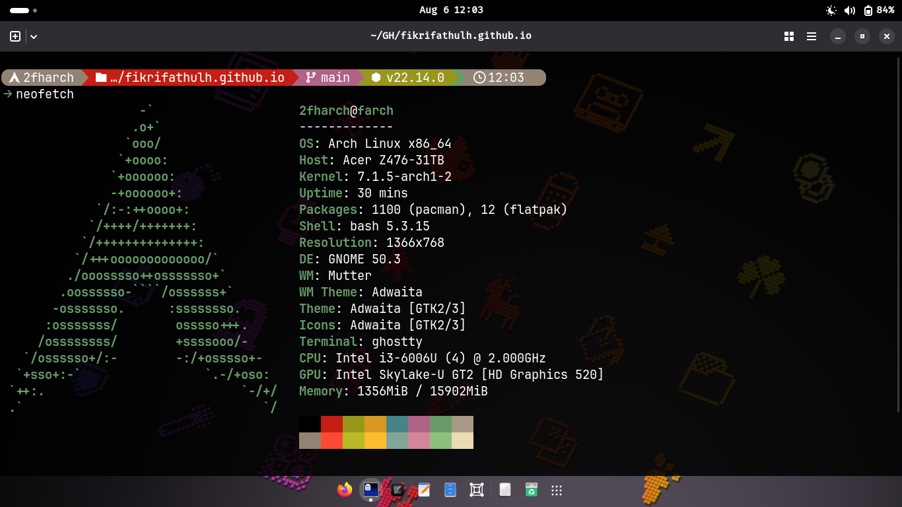
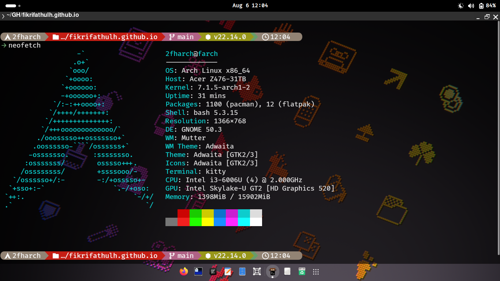
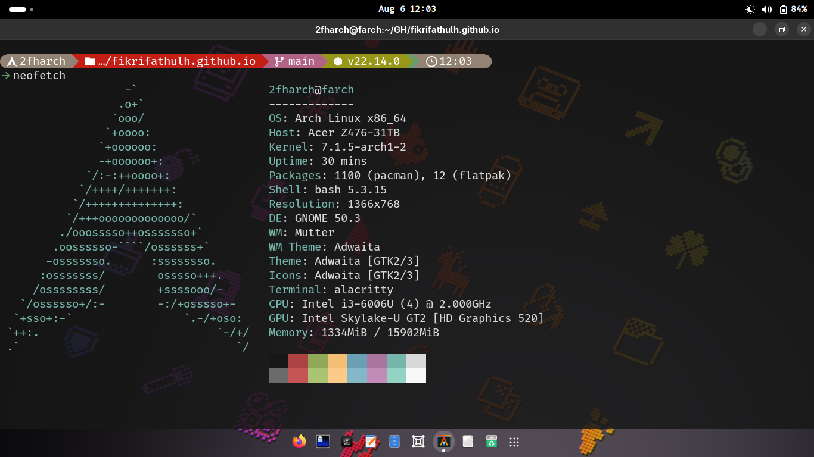
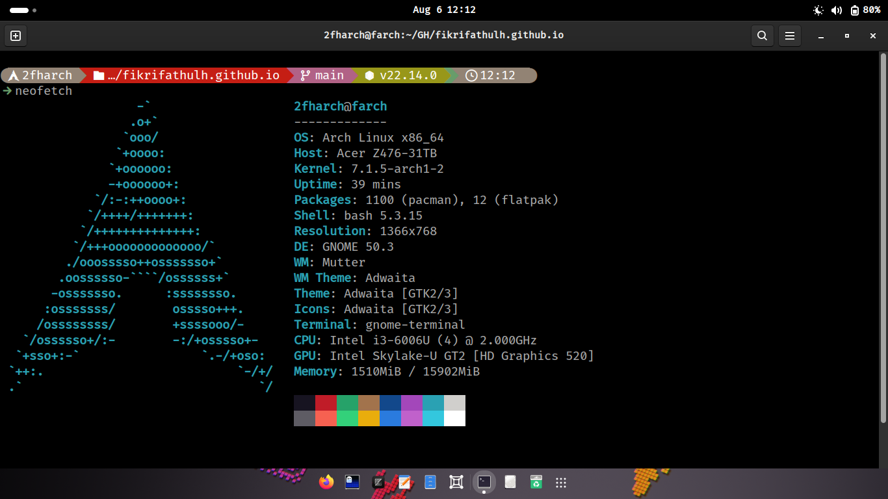
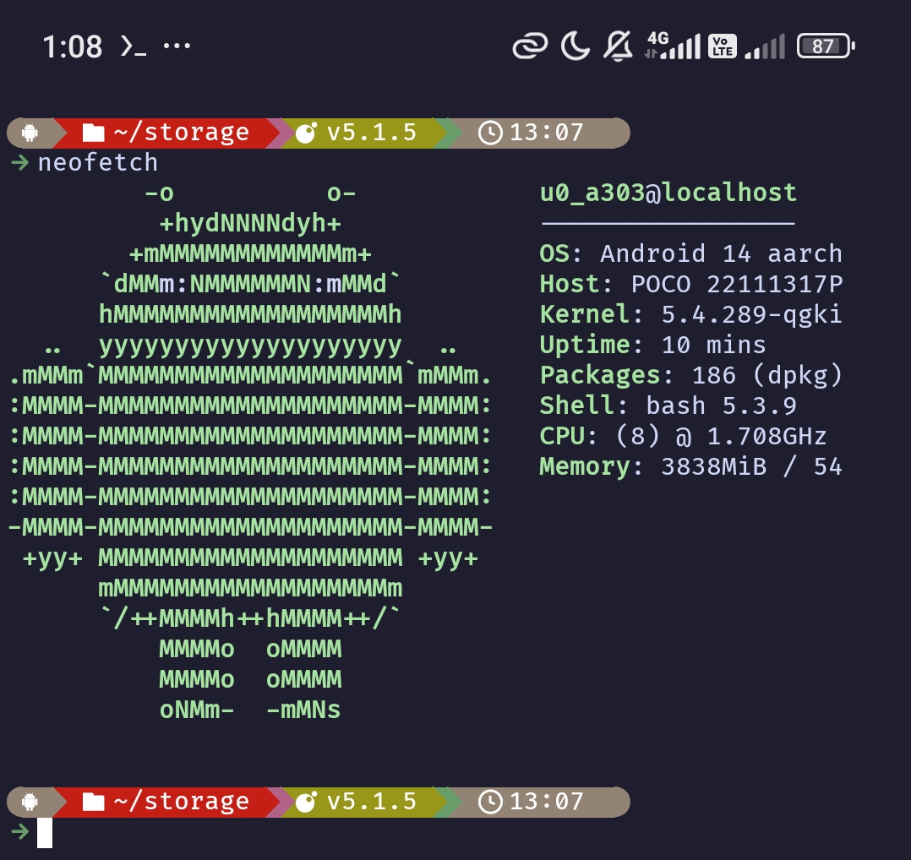

## Hyper Starship
Hyper Starship is Starship preset inspired by [Gruvbox Rainbow Preset](https://starship.rs/presets/gruvbox-rainbow) and [Hyper](https://hyper.is) color palette. Supported on Ghostty without [NerdFont](https://www.nerdfonts.com) but if you use other terminal like Kitty, Alacritty, Gnome Terminal, Etc; you need [NerdFont](https://www.nerdfonts.com) enabled in your terminal configuration. It would also be better to use the same color palette as my terminal.
### Screenshoot
#### Ghostty

#### Kitty

#### Alacritty

#### Gnome Terminal

#### Termux

### License
[Unlicense](LICENSE)
